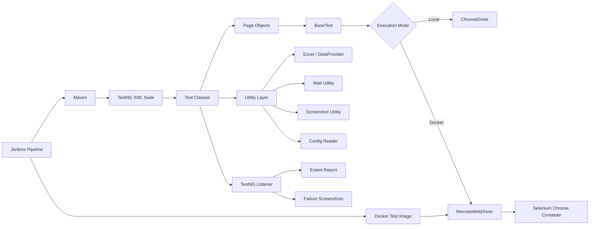
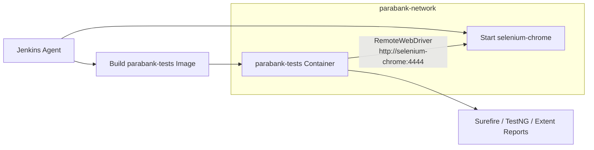
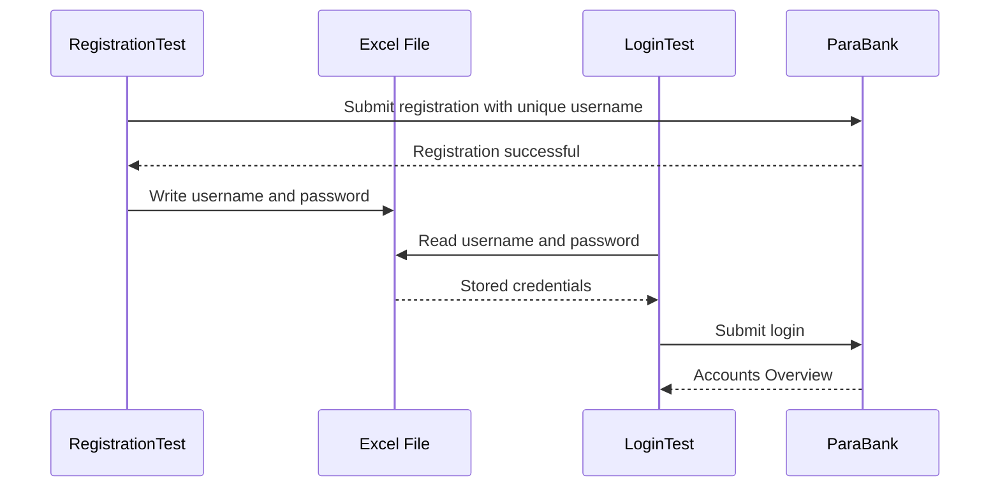
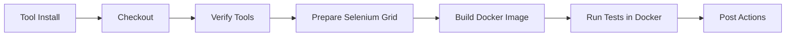

# ParaBank Automation Testing Framework

<p align="center">
  <strong>Production-style UI automation framework for the ParaBank BFSI application using Java, Selenium WebDriver, TestNG, Maven, Jenkins, Docker, Selenium Grid, Apache POI, Log4j2 and Extent Reports.</strong>
</p>

<p align="center">
  
  
  
  
</p>

<p align="center">
  
  
  
  
</p>

<p align="center">
  <a href="https://github.com/surajforu/Wipro-CapstoneProject-ParaBank-Automation">
    
  </a>
  <a href="https://github.com/surajforu/Wipro-CapstoneProject-ParaBank-Automation/fork">
    
  </a>
</p>

---

## Table of Contents

- [Project Overview](#project-overview)
- [Business Workflows Covered](#business-workflows-covered)
- [Verified Execution Status](#verified-execution-status)
- [Key Capabilities](#key-capabilities)
- [Technology Stack](#technology-stack)
- [Framework Architecture](#framework-architecture)
- [Design Decisions](#design-decisions)
- [Project Structure](#project-structure)
- [Test Coverage](#test-coverage)
- [Test Data Flow](#test-data-flow)
- [Prerequisites](#prerequisites)
- [Installation](#installation)
- [Configuration](#configuration)
- [Local Execution](#local-execution)
- [Docker and Selenium Grid Execution](#docker-and-selenium-grid-execution)
- [Jenkins CI/CD Pipeline](#jenkins-cicd-pipeline)
- [Reports and Artifacts](#reports-and-artifacts)
- [Execution Evidence](#execution-evidence)
- [Troubleshooting](#troubleshooting)
- [Engineering Practices](#engineering-practices)
- [Future Enhancements](#future-enhancements)
- [Author](#author)

---

## Project Overview

This repository contains a modular automation testing framework built for the **ParaBank demo banking application**.

The framework validates critical BFSI workflows including customer registration, credential persistence, valid and invalid authentication, savings-account creation, account overview, balance verification, fund transfer and bill payment. It supports both local Chrome execution and remote browser execution through Docker-based Selenium Grid.

### Application Under Test

**ParaBank:** `https://parabank.parasoft.com/parabank/index.htm`

> ParaBank is a public demonstration environment. Temporary application instability, server errors or data resets can occur independently of the automation framework.

### Project Objective

The framework demonstrates how a Java SDET solution can combine:

- maintainable Page Object Model design,
- reusable test utilities,
- Excel-based data flow,
- TestNG assertions and listeners,
- containerized browser execution,
- Jenkins CI/CD orchestration,
- automated test reporting and artifact publication.

---

## Business Workflows Covered

```text
Customer Registration
        ↓
Save Generated Credentials to Excel
        ↓
Read Credentials from Excel
        ↓
Valid Login
        ↓
Create Savings Account
        ↓
Validate Account Overview
        ↓
Transfer Funds and Verify Remaining Balance
        ↓
Bill Payment with Multiple Data Sets
        ↓
Invalid and Empty Login Validation
        ↓
Generate TestNG, Surefire and Extent Reports
```

---

## Verified Execution Status

The latest verified execution completed successfully with:

| Metric | Result |
|---|---:|
| Total tests | 8 |
| Passed | 8 |
| Failed | 0 |
| Errors | 0 |
| Skipped | 0 |
| Test execution time | 50.15 seconds |
| Maven build time | 53.634 seconds |
| Maven result | `BUILD SUCCESS` |
| Jenkins pipeline | Successful |
| Jenkins build shown | `#23` |

### Passed Scenarios

```text
✓ Registration
✓ Valid Login
✓ Open New Account
✓ Transfer Funds
✓ Bill Payment — Dataset 1
✓ Bill Payment — Dataset 2
✓ Invalid Login
✓ Empty Login
```

---

## Key Capabilities

### Framework Design

- Page Object Model for locator and action separation
- Modular TestNG test classes
- Base test layer for driver lifecycle management
- Local `ChromeDriver` and Docker `RemoteWebDriver` support
- Reusable explicit wait and screenshot utilities
- TestNG listener integration
- Extent report generation
- Maven Surefire reporting

### Test Data

- Apache POI Excel read and write
- Dynamic username generation with `System.currentTimeMillis()`
- Registration-to-login credential persistence
- TestNG DataProvider support for multiple datasets

### CI/CD and Containerization

- Jenkins declarative pipeline
- Tool validation for Java, Git and Docker
- Dedicated Docker network
- Selenium Standalone Chrome container
- Maven test container
- Selenium readiness validation
- Build-number-based Docker image and container names
- JUnit XML publishing
- Artifact archiving
- Extent HTML report publishing
- Automatic Docker cleanup

---

## Technology Stack

| Category | Technology |
|---|---|
| Programming language | Java 21 |
| UI automation | Selenium WebDriver 4.35.0 |
| Test framework | TestNG 7.11.0 |
| Build and dependency management | Apache Maven |
| Design pattern | Page Object Model |
| Local driver management | WebDriverManager |
| Remote browser | Selenium Standalone Chrome |
| Remote execution | RemoteWebDriver |
| Test data | Microsoft Excel and Apache POI |
| Reporting | Extent Reports and Maven Surefire |
| Logging | Log4j2 |
| CI/CD | Jenkins Declarative Pipeline |
| Containerization | Docker Desktop |
| Version control | Git and GitHub |
| IDE | Eclipse |

---

## Framework Architecture



### Docker Network Architecture



### Framework Layers

| Layer | Responsibility |
|---|---|
| Base | Driver initialization, local or remote selection, timeouts and teardown |
| Pages | Element locators and reusable business actions |
| Tests | Test scenarios, assertions and workflow validation |
| Utilities | Configuration, Excel, waits, screenshots and data providers |
| Listeners | Test events, report status and failure evidence |
| Reporting | Extent report configuration and Surefire result generation |
| CI/CD | Checkout, Docker orchestration, test execution and artifact publication |

---

## Design Decisions

### Separate Test and Browser Containers

The Maven image contains the automation code, Java and Maven. Browser execution is delegated to the official Selenium Chrome image. This avoids installing Chrome and ChromeDriver inside the test container.

### Docker DNS Instead of `localhost`

Inside the test container, `localhost` refers to the test container itself. The framework therefore connects to:

```text
http://selenium-chrome:4444
```

Both containers must be attached to:

```text
parabank-network
```

### Local and Docker Execution Switch

The base class reads:

```text
-Dheadless=true
-Ddocker=true
-Dselenium.grid.url=http://selenium-chrome:4444
```

When `docker=false`, the framework uses local `ChromeDriver`. When `docker=true`, it uses `RemoteWebDriver`.

### Artifact Preservation

The Jenkins pipeline copies reports from the completed test container before removing it. This allows Jenkins to publish test results even though the container is temporary.

---

## Project Structure

```text
Wipro-CapstoneProject-ParaBank-Automation/
│
├── README.md
├── docs/
│   └── images/
│       ├── local-execution-summary.png
│       ├── docker-test-build-success.png
│       ├── jenkins-pipeline-success.png
│       ├── jenkins-dashboard-success.png
│       ├── eclipse-project-structure.png
│       └── eclipse-root-files.png
│
└── ParaBankAutomationFramework/
    ├── src/
    │   ├── main/
    │   │   ├── java/
    │   │   └── resources/
    │   │
    │   └── test/
    │       ├── java/
    │       │   ├── com/parabank/base/
    │       │   │   └── BaseTest.java
    │       │   ├── listeners/
    │       │   │   └── TestListener.java
    │       │   ├── pages/
    │       │   │   ├── AccountOverviewPage.java
    │       │   │   ├── BillPayPage.java
    │       │   │   ├── LoginPage.java
    │       │   │   ├── OpenAccountPage.java
    │       │   │   ├── RegistrationPage.java
    │       │   │   └── TransferFundsPage.java
    │       │   ├── reports/
    │       │   │   └── ExtentManager.java
    │       │   ├── testcases/
    │       │   │   ├── AccountOverviewTest.java
    │       │   │   ├── BillPayTest.java
    │       │   │   ├── LoginTest.java
    │       │   │   ├── NegativeTest.java
    │       │   │   ├── OpenAccountTest.java
    │       │   │   ├── RegistrationTest.java
    │       │   │   └── TransferFundsTest.java
    │       │   └── utilities/
    │       │       ├── ConfigReader.java
    │       │       ├── DataProviders.java
    │       │       ├── ExcelUtils.java
    │       │       ├── ScreenshotUtil.java
    │       │       └── WaitUtils.java
    │       │
    │       └── resources/
    │           ├── config/
    │           │   └── config.properties
    │           ├── testdata/
    │           │   └── ParabankData.xlsx
    │           └── log4j2.xml
    │
    ├── screenshots/
    ├── target/
    ├── test-output/
    ├── Dockerfile
    ├── JenkinsFile
    ├── pom.xml
    ├── testng.xml
    └── testng-negative.xml
```

---

## Test Coverage

| Module | Test Scenario | Test Data | Main Validation |
|---|---|---|---|
| Registration | Register a new customer | Excel and generated username | Registration successful |
| Login | Login with stored credentials | Excel | Login successful |
| Open Account | Create a savings account | Runtime account data | New account created |
| Account Overview | Read account details and balance | Runtime data | Account and balance visible |
| Transfer Funds | Transfer between existing accounts | Amount and account IDs | Transfer confirmation and updated balance |
| Bill Payment | Pay a bill | Multiple datasets | Payment successful |
| Negative Login | Invalid credentials | Negative test data | Login error verified |
| Empty Login | Blank username and password | Empty values | Validation message verified |

### Assertion Strategy

The framework validates:

- expected confirmation text,
- successful page navigation,
- dynamically generated account numbers,
- balance before and after transfer,
- invalid-login error messages,
- empty-login validation,
- successful bill-payment confirmation.

---

## Test Data Flow



Example username generation:

```java
String username = "suraj" + System.currentTimeMillis();
```

This prevents duplicate-registration conflicts in repeated executions.

---

## Prerequisites

Install and configure:

- Java JDK 21
- Apache Maven
- Git
- Google Chrome for local execution
- Docker Desktop
- Jenkins for CI/CD execution
- Eclipse or IntelliJ IDEA

Verify:

```powershell
java -version
mvn -version
git --version
docker version
```

---

## Installation

### Clone the Repository

```powershell
git clone https://github.com/surajforu/Wipro-CapstoneProject-ParaBank-Automation.git
cd Wipro-CapstoneProject-ParaBank-Automation
```

### Compile the Maven Project

```powershell
cd ParaBankAutomationFramework
mvn clean compile
```

### Import into Eclipse

1. Open Eclipse.
2. Select **File → Import**.
3. Choose **Existing Maven Projects**.
4. Select the `ParaBankAutomationFramework` directory.
5. Click **Finish**.
6. Select **Maven → Update Project** if dependencies are not resolved.

---

## Configuration

Configuration file:

```text
ParaBankAutomationFramework/src/test/resources/config/config.properties
```

Example:

```properties
url=https://parabank.parasoft.com/parabank/index.htm
browser=chrome
timeout=10
```

### Supported System Properties

| Property | Example | Purpose |
|---|---|---|
| `headless` | `-Dheadless=true` | Executes Chrome without opening the browser UI |
| `docker` | `-Ddocker=true` | Enables `RemoteWebDriver` |
| `selenium.grid.url` | `-Dselenium.grid.url=http://selenium-chrome:4444` | Defines the Selenium server URL |

---

## Local Execution

Enter the Maven project:

```powershell
cd ParaBankAutomationFramework
```

### Run the Complete Suite

```powershell
mvn clean test
```

### Run Headless

```powershell
mvn clean test -Dheadless=true
```

### Run a Specific Class

```powershell
mvn test -Dtest=testcases.LoginTest
```

### Run a Specific Method

```powershell
mvn test "-Dtest=testcases.LoginTest#verifyValidLogin"
```

### Run from Eclipse

1. Open `testng.xml`.
2. Right-click the file.
3. Select **Run As → TestNG Suite**.

> Run the full suite when dependent data such as credentials and account numbers must be generated in sequence.

---

## Docker and Selenium Grid Execution

### Container Model

| Container | Purpose |
|---|---|
| `selenium-chrome` | Runs Chrome and Selenium server |
| `parabank-tests` | Compiles and executes Maven/TestNG automation |

### Create the Docker Network

```powershell
docker network inspect parabank-network *> $null

if ($LASTEXITCODE -ne 0) {
    docker network create parabank-network
}
```

### Start Selenium Chrome

```powershell
docker rm -f selenium-chrome 2>$null

docker run -d `
  --name selenium-chrome `
  --network parabank-network `
  -p 4444:4444 `
  --shm-size=2g `
  selenium/standalone-chrome:latest
```

### Verify Selenium Readiness

```powershell
Invoke-RestMethod http://localhost:4444/status
```

Expected value:

```text
ready : True
```

### Build the Test Image

```powershell
cd ParaBankAutomationFramework
docker build --no-cache -t parabank-tests:latest .
```

### Run the Test Container

```powershell
docker rm -f parabank-tests 2>$null

docker run `
  --name parabank-tests `
  --network parabank-network `
  parabank-tests:latest
```

### Copy Reports Before Removing the Container

```powershell
docker cp parabank-tests:/app/target/surefire-reports .\target\
docker cp parabank-tests:/app/test-output .
docker cp parabank-tests:/app/screenshots .
```

### Clean Up

```powershell
docker rm -f parabank-tests
docker rm -f selenium-chrome
```

---

## Jenkins CI/CD Pipeline

### Pipeline Stages



### Jenkins Job Configuration

| Setting | Value |
|---|---|
| Job type | Pipeline |
| Definition | Pipeline script from SCM |
| SCM | Git |
| Repository | `https://github.com/surajforu/Wipro-CapstoneProject-ParaBank-Automation.git` |
| Branch | `*/main` |
| Script path | `ParaBankAutomationFramework/JenkinsFile` |

### Required Jenkins Tools

Configure under **Manage Jenkins → Tools**:

```text
JDK name: jdk21
Maven name: Maven3
```

### Recommended Plugins

- Git
- Pipeline
- Maven Integration
- TestNG Results
- HTML Publisher
- JUnit

### Pipeline Responsibilities

The pipeline:

1. checks out the latest source code,
2. verifies Java, Git and Docker,
3. creates or reuses `parabank-network`,
4. starts `selenium-chrome`,
5. waits until Selenium is ready,
6. builds a test image tagged with the Jenkins build number,
7. runs tests on the same Docker network,
8. copies reports and screenshots,
9. publishes JUnit XML results,
10. archives artifacts,
11. publishes the Extent HTML report,
12. removes temporary containers and images.

### Jenkins Quality Gate

The build is marked failed when the Docker test command returns a non-zero exit code. Test results and artifacts are still processed in the `post` section.

---

## Reports and Artifacts

| Artifact | Location | Purpose |
|---|---|---|
| Extent Report | `test-output/ExtentReport.html` | Human-readable execution report |
| Surefire XML | `target/surefire-reports/*.xml` | Jenkins JUnit test publication |
| TestNG Output | `test-output/` | Native TestNG reports |
| Screenshots | `screenshots/` | Failure evidence |
| Logs | Configured through `log4j2.xml` | Execution diagnostics |

### Jenkins Published Outputs

- **Latest Test Result**
- **Test Result Trend**
- **Last Successful Artifacts**
- **ParaBank Extent Report**
- archived Surefire XML files,
- archived screenshots and TestNG output.

---

## Execution Evidence

### Successful Maven and TestNG Execution

<p align="center">
  
</p>

### Successful Jenkins Docker Pipeline

<p align="center">
  
</p>

### Jenkins Dashboard and Test Trend

<p align="center">
  
</p>

### Eclipse Framework Structure

<table>
  <tr>
    <td width="62%">
      
    </td>
    <td width="38%">
      
    </td>
  </tr>
</table>

### Additional Local Execution View

<p align="center">
  
</p>

---

## Troubleshooting

### `Dockerfile` Not Found

Use the standard filename exactly:

```text
Dockerfile
```

Build from the folder containing that file:

```powershell
docker build -t parabank-tests:latest .
```

### `selenium-chrome` Cannot Be Resolved

Symptoms include:

```text
UnresolvedAddressException
ConnectException
```

Confirm both containers use the same network:

```powershell
docker network inspect parabank-network
```

The test container must include:

```powershell
--network parabank-network
```

### Selenium Grid Is Not Ready

Check:

```powershell
docker logs selenium-chrome
Invoke-RestMethod http://localhost:4444/status
```

Do not start tests until the response indicates `ready = true`.

### ChromeDriver Exit Code `127`

This indicates an attempt to start local ChromeDriver inside a Linux Maven container without the browser dependencies.

Use:

```java
new RemoteWebDriver(new URL(gridUrl), options);
```

for Docker mode instead of local `ChromeDriver`.

### Container Name Conflict

```powershell
docker rm -f parabank-tests
docker rm -f selenium-chrome
```

Jenkins uses build-number-based test container names to reduce conflicts.

### ParaBank Internal Server Error

The public ParaBank environment can be unstable. Confirm:

- the application is accessible manually,
- the generated username is unique,
- the account data still exists,
- the failure is not caused by a temporary server response.

### Screenshots Not Captured

A screenshot cannot be taken when driver setup fails and `driver == null`. The listener should check the driver before capturing evidence.

### Git Generated Files

Do not commit generated output. Recommended `.gitignore`:

```gitignore
target/
test-output/
screenshots/
logs/
*.log
.classpath
.project
.settings/
.idea/
*.iml
```

---

## Engineering Practices

- Keep locators inside page classes.
- Keep assertions inside test classes.
- Avoid hard-coded waits where explicit waits can be used.
- Generate unique registration data.
- Avoid committing real credentials or secrets.
- Treat Excel data as test data, not as a secure credential store.
- Use `RemoteWebDriver` only when Docker mode is enabled.
- Keep Docker image names and container names predictable.
- Wait for Selenium readiness before executing tests.
- Copy reports before deleting containers.
- Fail the pipeline on non-zero test status.
- Archive reports even when tests fail.
- Keep generated reports out of Git history.

---

## Future Enhancements

- ThreadLocal WebDriver for parallel execution
- Cross-browser Selenium Grid with Chrome, Firefox and Edge
- Retry Analyzer for transient failures
- Docker Compose orchestration
- REST Assured API validation
- JDBC database validation
- Allure reporting
- Jenkins email or chat notifications
- GitHub webhook-triggered builds
- Environment-specific configuration
- Secret management through Jenkins Credentials
- BrowserStack or Sauce Labs integration
- Docker image publishing to a registry
- Static analysis with SonarQube
- Dependency and security scanning
- Parallel test execution with isolated test data

---

## Author

**Suraj Shaw**

- **Role:** Java SDET / QA Automation Engineer
- **Location:** Kolkata, West Bengal, India
- **GitHub:** [surajforu](https://github.com/surajforu)
- **Repository:** [Wipro-CapstoneProject-ParaBank-Automation](https://github.com/surajforu/Wipro-CapstoneProject-ParaBank-Automation)
- **Email:** `thisissurajshaw@gmail.com`
- **Core Skills:** Java, Selenium, TestNG, Maven, Jenkins, Docker, SQL, REST Assured and Git

---

## Project Purpose

This project was developed as a capstone framework to demonstrate end-to-end UI automation, test data handling, containerized execution and Jenkins CI/CD integration for a BFSI application.

<p align="center">
  <strong>If this project helps you understand automation framework development, consider giving the repository a star.</strong>
</p>
