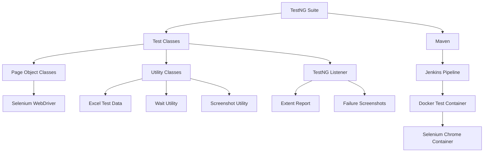

# ParaBank Automation Testing Framework

<p align="center">
  <strong>End-to-end banking application automation using Java, Selenium WebDriver, TestNG, Maven, Jenkins, Docker, Apache POI, Log4j2 and Extent Reports.</strong>
</p>

<p align="center">
  
  
  
  
  
  
</p>

---

## Table of Contents

- [Project Overview](#project-overview)
- [Key Features](#key-features)
- [Automated Test Coverage](#automated-test-coverage)
- [Technology Stack](#technology-stack)
- [Framework Architecture](#framework-architecture)
- [Project Structure](#project-structure)
- [Execution Flow](#execution-flow)
- [Prerequisites](#prerequisites)
- [Installation and Setup](#installation-and-setup)
- [Configuration](#configuration)
- [Run Tests Locally](#run-tests-locally)
- [Run a Single Test](#run-a-single-test)
- [Docker Execution](#docker-execution)
- [Jenkins CI/CD Integration](#jenkins-cicd-integration)
- [Reports, Logs and Screenshots](#reports-logs-and-screenshots)
- [Test Data Management](#test-data-management)
- [Test Results](#test-results)
- [Troubleshooting](#troubleshooting)
- [Future Enhancements](#future-enhancements)
- [Author](#author)

---

## Project Overview

This project is a scalable automation testing framework developed for the **ParaBank demo banking application**.

The framework automates major BFSI workflows such as registration, login, account creation, fund transfer, bill payment and negative login validation. It follows the **Page Object Model** design pattern and supports data-driven testing, reusable utilities, automatic screenshots, HTML reporting, Jenkins-based continuous integration and Docker-based execution.

### Application Under Test

**ParaBank:** `https://parabank.parasoft.com/parabank/index.htm`

> ParaBank is a public demonstration application. At times, the application may be slow or may return an internal server error. Such failures should be validated separately from framework failures.

---

## Key Features

- Page Object Model design pattern
- Modular TestNG test classes
- Valid and invalid login validation
- Dynamic user registration
- Excel read/write using Apache POI
- TestNG DataProvider support
- Explicit and implicit wait utilities
- Screenshot capture on test failure
- Extent HTML report generation
- Log4j2 logging
- TestNG Listener integration
- Ordered suite execution using `testng.xml`
- Maven command-line execution
- Jenkins pipeline integration
- Docker and Selenium Grid support
- Local and headless browser execution
- Git and GitHub version control

---

## Automated Test Coverage

| Module | Test Scenario | Validation |
|---|---|---|
| Registration | Register a new customer with a unique username | Registration success message |
| Login | Login using Excel-stored credentials | Accounts Overview page |
| Open Account | Create a new savings account | New account number |
| Account Overview | Validate account information | Account table and balance |
| Transfer Funds | Transfer money between accounts | Confirmation and updated balance |
| Bill Payment | Pay bills using multiple datasets | Payment confirmation |
| Negative Login | Login using invalid credentials | Error message |
| Empty Login | Submit empty credentials | Required-field/error validation |

---

## Technology Stack

| Category | Technology |
|---|---|
| Programming Language | Java 21 |
| UI Automation | Selenium WebDriver 4.35.0 |
| Test Framework | TestNG 7.11.0 |
| Build Tool | Apache Maven |
| Design Pattern | Page Object Model |
| Driver Management | WebDriverManager |
| Test Data | Microsoft Excel with Apache POI |
| Reporting | Extent Reports |
| Logging | Log4j2 |
| CI/CD | Jenkins Pipeline |
| Containerization | Docker |
| Remote Execution | Selenium Standalone Chrome / RemoteWebDriver |
| Version Control | Git and GitHub |
| IDE | Eclipse |

---

## Framework Architecture



### Framework Layers

1. **Base Layer**  
   Handles browser initialization, local or remote execution, timeouts and teardown.

2. **Page Layer**  
   Stores web element locators and reusable business actions.

3. **Test Layer**  
   Contains TestNG test methods and assertions.

4. **Utility Layer**  
   Contains Excel, configuration, waits, screenshots and data providers.

5. **Reporting Layer**  
   Contains Extent Report configuration and TestNG Listener implementation.

6. **CI/CD Layer**  
   Executes the framework through Jenkins and Docker.

---

## Project Structure

```text
Wipro-CapstoneProject-ParaBank-Automation/
│
└── ParaBankAutomationFramework/
    │
    ├── src/
    │   └── test/
    │       ├── java/
    │       │   ├── com/parabank/base/
    │       │   │   └── BaseTest.java
    │       │   │
    │       │   ├── pages/
    │       │   │   ├── RegistrationPage.java
    │       │   │   ├── LoginPage.java
    │       │   │   ├── OpenAccountPage.java
    │       │   │   ├── AccountOverviewPage.java
    │       │   │   ├── TransferFundsPage.java
    │       │   │   └── BillPayPage.java
    │       │   │
    │       │   ├── testcases/
    │       │   │   ├── RegistrationTest.java
    │       │   │   ├── LoginTest.java
    │       │   │   ├── OpenAccountTest.java
    │       │   │   ├── AccountOverviewTest.java
    │       │   │   ├── TransferFundsTest.java
    │       │   │   ├── BillPayTest.java
    │       │   │   └── NegativeTest.java
    │       │   │
    │       │   ├── utilities/
    │       │   │   ├── ConfigReader.java
    │       │   │   ├── ExcelUtils.java
    │       │   │   ├── DataProviders.java
    │       │   │   ├── WaitUtils.java
    │       │   │   └── ScreenshotUtil.java
    │       │   │
    │       │   ├── listeners/
    │       │   │   └── TestListener.java
    │       │   │
    │       │   └── reports/
    │       │       └── ExtentManager.java
    │       │
    │       └── resources/
    │           ├── config/
    │           │   └── config.properties
    │           ├── testdata/
    │           │   └── ParabankData.xlsx
    │           └── log4j2.xml
    │
    ├── screenshots/
    ├── test-output/
    ├── pom.xml
    ├── testng.xml
    ├── JenkinsFile
    ├── DockerFile
    └── README.md
```

---

## Execution Flow

```text
TestNG Suite
    ↓
RegistrationTest
    ↓
Generate unique username
    ↓
Store username and password in Excel
    ↓
LoginTest reads credentials from Excel
    ↓
Open Account
    ↓
Validate Account Overview
    ↓
Transfer Funds
    ↓
Pay Bills using multiple datasets
    ↓
Execute negative login tests
    ↓
Generate reports, logs and screenshots
```

The suite executes in a controlled order because later modules depend on the customer and account data created by earlier modules.

---

## Prerequisites

Install the following software before execution:

- Java JDK 21
- Apache Maven
- Google Chrome
- Eclipse or IntelliJ IDEA
- Git
- Docker Desktop
- Jenkins, for CI/CD execution

Verify installations:

```bash
java -version
mvn -version
git --version
docker version
```

---

## Installation and Setup

### 1. Clone the repository

```bash
git clone https://github.com/surajforu/Wipro-CapstoneProject-ParaBank-Automation.git
```

### 2. Enter the Maven project directory

```bash
cd Wipro-CapstoneProject-ParaBank-Automation/ParaBankAutomationFramework
```

### 3. Install Maven dependencies

```bash
mvn clean compile
```

### 4. Import into Eclipse

1. Open Eclipse.
2. Select **File → Import**.
3. Choose **Existing Maven Projects**.
4. Select the `ParaBankAutomationFramework` folder.
5. Click **Finish**.
6. Right-click the project and select **Maven → Update Project**.

---

## Configuration

Update:

```text
src/test/resources/config/config.properties
```

Example:

```properties
url=https://parabank.parasoft.com/parabank/index.htm
browser=chrome
timeout=10
```

### Supported System Properties

| Property | Example | Purpose |
|---|---|---|
| `headless` | `-Dheadless=true` | Runs Chrome without a visible UI |
| `docker` | `-Ddocker=true` | Enables RemoteWebDriver execution |
| `selenium.grid.url` | `-Dselenium.grid.url=http://selenium-chrome:4444` | Selenium Grid URL |

---

## Run Tests Locally

### Run the complete TestNG suite

```bash
mvn clean test
```

### Run in headless mode

```bash
mvn clean test -Dheadless=true
```

### Run from Eclipse

1. Open `testng.xml`.
2. Right-click inside the file.
3. Select **Run As → TestNG Suite**.

---

## Run a Single Test

### Run one test class

```bash
mvn test -Dtest=testcases.LoginTest
```

### Run one test method

```bash
mvn test -Dtest=testcases.LoginTest#verifyValidLogin
```

### Additional examples

```bash
mvn test -Dtest=testcases.RegistrationTest
mvn test -Dtest=testcases.OpenAccountTest
mvn test -Dtest=testcases.TransferFundsTest
mvn test -Dtest=testcases.BillPayTest
mvn test -Dtest=testcases.NegativeTest
```

> Some tests depend on credentials or accounts created by earlier tests. For a fully independent run, execute the complete TestNG suite.

---

## Docker Execution

The recommended Docker setup uses:

- One Maven test container
- One Selenium Standalone Chrome container
- One Docker network for communication

### 1. Create the network

```powershell
docker network create parabank-network
```

### 2. Start Selenium Chrome

```powershell
docker run -d `
  --name selenium-chrome `
  --network parabank-network `
  --shm-size=2g `
  -p 4444:4444 `
  selenium/standalone-chrome:latest
```

### 3. Verify Selenium Grid

```powershell
Invoke-RestMethod http://localhost:4444/status
```

The response should show:

```text
ready : True
```

### 4. Build the test image

The current project uses the filename `DockerFile`, so specify it with `-f`:

```powershell
docker build -f DockerFile -t parabank-tests:latest .
```

### 5. Run the complete suite

```powershell
docker run `
  --name parabank-tests `
  --network parabank-network `
  parabank-tests:latest
```

### 6. Run a single test class in Docker

```powershell
docker run --rm `
  --network parabank-network `
  parabank-tests:latest `
  mvn test `
  -Dtest=testcases.LoginTest `
  -Dheadless=true `
  -Ddocker=true `
  -Dselenium.grid.url=http://selenium-chrome:4444
```

### 7. Copy reports from the container

```powershell
docker cp parabank-tests:/app/target/surefire-reports .\target\surefire-reports
docker cp parabank-tests:/app/test-output .\test-output
docker cp parabank-tests:/app/screenshots .\screenshots
```

### 8. Clean up containers

```powershell
docker rm -f parabank-tests
docker rm -f selenium-chrome
docker network rm parabank-network
```

---

## Jenkins CI/CD Integration

The Jenkins pipeline automates:

1. Source-code checkout
2. Java, Maven, Git and Docker verification
3. Maven or Docker test execution
4. JUnit result publishing
5. Screenshot and artifact archiving
6. Extent Report publishing

### Required Jenkins Configuration

Configure these tools under:

```text
Manage Jenkins → Tools
```

Suggested names:

```text
JDK: jdk21
Maven: Maven3
```

Install these plugins:

- Git
- Pipeline
- Maven Integration
- TestNG Results
- HTML Publisher

### Pipeline Script Path

When the `JenkinsFile` is inside the project subfolder, configure:

```text
ParaBankAutomationFramework/JenkinsFile
```

### Jenkins Reports

The pipeline publishes:

```text
ParaBankAutomationFramework/target/surefire-reports/
ParaBankAutomationFramework/test-output/
ParaBankAutomationFramework/screenshots/
```

---

## Reports, Logs and Screenshots

### Extent Report

```text
test-output/ExtentReport.html
```

The report contains:

- Test names
- Pass/fail status
- Failure stack traces
- Screenshot links
- Execution details

### Surefire Reports

```text
target/surefire-reports/
```

These XML files are used by Jenkins to publish test results.

### Screenshots

```text
screenshots/
```

A screenshot is captured automatically when a test fails.

Example naming pattern:

```text
verifyValidLogin_20260613_083912.png
```

### Logs

Log4j2 configuration:

```text
src/test/resources/log4j2.xml
```

---

## Test Data Management

The framework uses:

```text
src/test/resources/testdata/ParabankData.xlsx
```

### Registration-to-Login Data Flow

1. `RegistrationTest` generates a unique username.
2. Apache POI writes the username and password to Excel.
3. `LoginTest` reads the same credentials.
4. The remaining modules reuse the logged-in customer data.

Unique username example:

```java
String username = "suraj" + System.currentTimeMillis();
```

This prevents duplicate-user registration failures.

---

## Test Results

Latest successful execution:

```text
Total tests run: 8
Passes: 8
Failures: 0
Skips: 0
```

Covered scenarios:

```text
✓ Registration
✓ Valid Login
✓ Open Account
✓ Transfer Funds
✓ Bill Payment — Dataset 1
✓ Bill Payment — Dataset 2
✓ Invalid Login
✓ Empty Login
```

---

## Troubleshooting

### CDP Version Warning

Example:

```text
Unable to find CDP implementation matching the installed Chrome version
```

This warning does not affect normal WebDriver operations when the tests continue and pass. It is caused by a version difference between Chrome and Selenium DevTools support.

Do not add an unrelated DevTools version such as `selenium-devtools-v86` for Chrome 149.

### ParaBank Internal Server Error

Example:

```text
An internal error has occurred and has been logged.
```

This may be caused by instability in the public ParaBank environment. Recheck the same credentials manually and rerun the test later.

### ChromeDriver Exit Code 127 in Docker

This usually means Chrome or a required Linux dependency is unavailable inside the test container.

Recommended solution:

- Use the official `selenium/standalone-chrome` container.
- Connect through `RemoteWebDriver`.
- Keep Maven execution in a separate test container.

### DockerFile Not Found

The current filename is case-sensitive:

```text
DockerFile
```

Build with:

```bash
docker build -f DockerFile -t parabank-tests:latest .
```

Alternatively, rename it to the standard:

```text
Dockerfile
```

### Duplicate ExtentReports Dependency

Keep only one ExtentReports dependency in `pom.xml`:

```xml
<dependency>
    <groupId>com.aventstack</groupId>
    <artifactId>extentreports</artifactId>
    <version>5.1.2</version>
</dependency>
```

### Screenshot Is Not Captured

A screenshot cannot be captured when browser initialization fails and the WebDriver instance is `null`.

The listener should verify:

```java
if (base.getDriver() != null) {
    // Capture screenshot
}
```

---

## Future Enhancements

- ThreadLocal WebDriver for parallel execution
- Cross-browser execution using Chrome, Edge and Firefox
- TestNG Retry Analyzer
- REST Assured API validation
- Database validation using JDBC
- Selenium Grid with multiple browser nodes
- BrowserStack or Sauce Labs integration
- Allure reporting
- Jenkins email notifications
- Docker Compose configuration
- Environment-specific configuration
- Secrets management for credentials
- GitHub Actions pipeline
- Automatic Docker image publishing

---

## Author

**Suraj Shaw**

- GitHub: [surajforu](https://github.com/surajforu)
- Location: Kolkata, West Bengal, India
- Role: Java SDET / QA Automation Engineer
- Skills: Java, Selenium, TestNG, Maven, Jenkins, Docker, SQL, REST Assured and Git

---

## Project Purpose

This project was developed as a capstone automation framework for learning, demonstration and interview presentation purposes.

If this repository helps you understand Selenium framework development, consider giving it a star.
